# SimpleDonkeyManager

DonkeyCar로 수집한 주행 데이터를 불러오고, 학습에 쓰기 어려운 프레임을 정리한 뒤, 모델 학습과 결과 검증까지 한 번에 진행할 수 있도록 만든 Windows 데스크톱 프로그램입니다.

명령 프롬프트에서 DonkeyCar 명령을 직접 입력하는 대신, 데이터 확인부터 필터링, 학습 실행, 검증 결과 확인까지 GUI에서 이어서 처리하는 것을 목표로 했습니다.

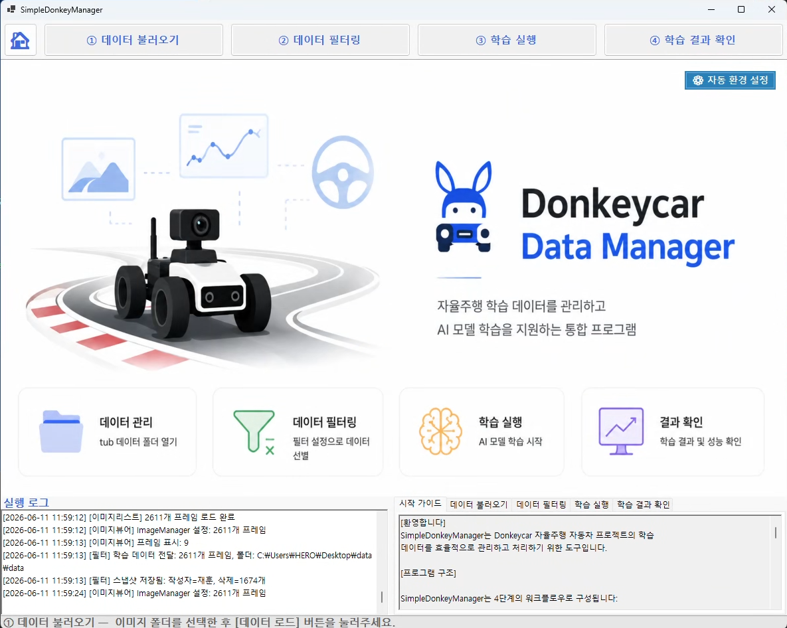

## 개발 배경

DonkeyCar 학습 데이터는 이미지와 메타데이터가 함께 쌓이기 때문에, 학습 전에 데이터 상태를 직접 확인하는 과정이 중요합니다. 하지만 수천 장 단위의 이미지를 파일 탐색기와 스크립트만으로 확인하면 어떤 프레임을 제외해야 하는지 판단하기 어렵고, 학습 결과도 따로 확인해야 합니다.

SimpleDonkeyManager는 이 과정을 하나의 흐름으로 묶었습니다.

- 주행 이미지와 조향/속도 데이터를 함께 확인
- 불필요한 프레임을 조건 또는 구간 단위로 제외
- DonkeyCar 학습 스크립트 실행
- 학습 그래프와 실제 조향값/AI 예측값 비교
- 필터링 이력 저장 및 복원

## 실행 환경

| 항목 | 내용 |
| --- | --- |
| OS | Windows 10/11 64bit |
| .NET | .NET 10 |
| Python | Python 3.10 이상, 권장 3.11 |
| 학습 라이브러리 | DonkeyCar 5.3.0, TensorFlow 2.15.1, NumPy 1.26.4 |
| 권장 사양 | RAM 16GB 이상, GPU는 선택 사항 |

## 환경 설정

처음 실행하는 PC에서는 관리자 권한 PowerShell로 자동 환경 설정을 실행합니다.

```powershell
powershell.exe -ExecutionPolicy Bypass -File setup-environment.ps1
```

프로그램 첫 화면의 `자동 환경 설정` 버튼으로도 같은 작업을 실행할 수 있습니다.

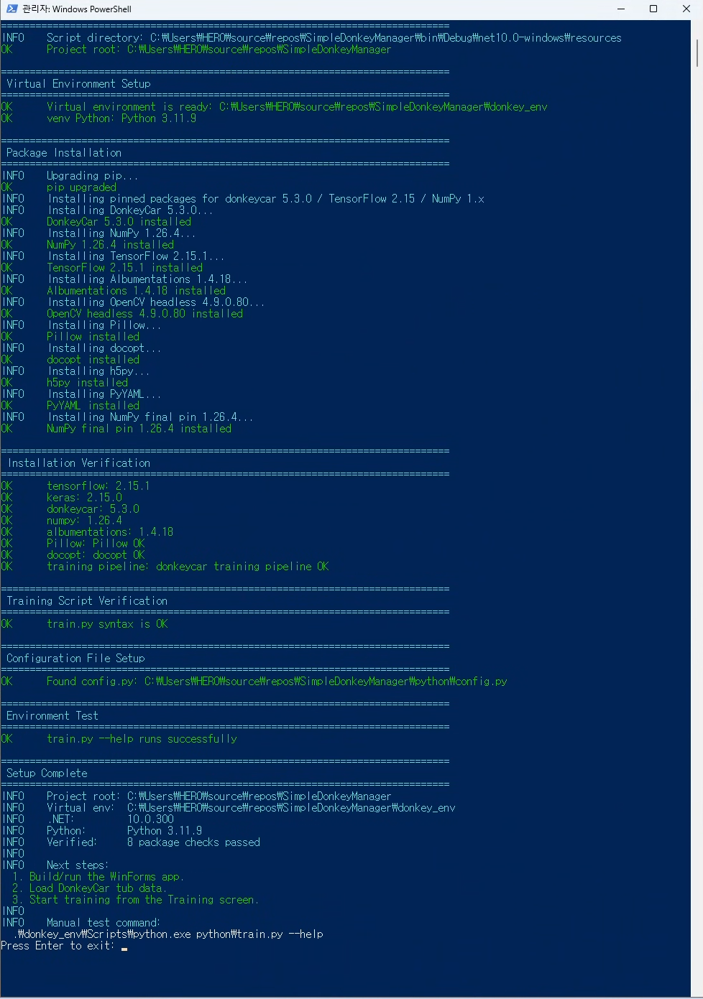

자동 설정 스크립트는 다음 작업을 처리합니다.

- .NET 10 설치 여부 확인
- Python 3.10 이상 감지
- `donkey_env` 가상환경 생성 또는 복구
- DonkeyCar 학습에 필요한 패키지 설치
- `python/train.py` 실행 가능 여부 확인
- `python/config.py` 준비

## 실행 방법

```powershell
dotnet build
dotnet run
```

Visual Studio에서 솔루션을 열어 실행해도 됩니다.

## 사용 흐름

### 1. 데이터 불러오기

`① 데이터 불러오기` 화면에서 DonkeyCar 데이터 폴더를 선택합니다. catalog가 있는 tub 데이터와 이미지/identifier 파일이 들어 있는 폴더를 모두 처리할 수 있도록 구성했습니다.

데이터를 불러오면 전체 이미지 수, 이미지 형식, 해상도, 파일 크기, catalog 인식 여부를 확인할 수 있습니다.

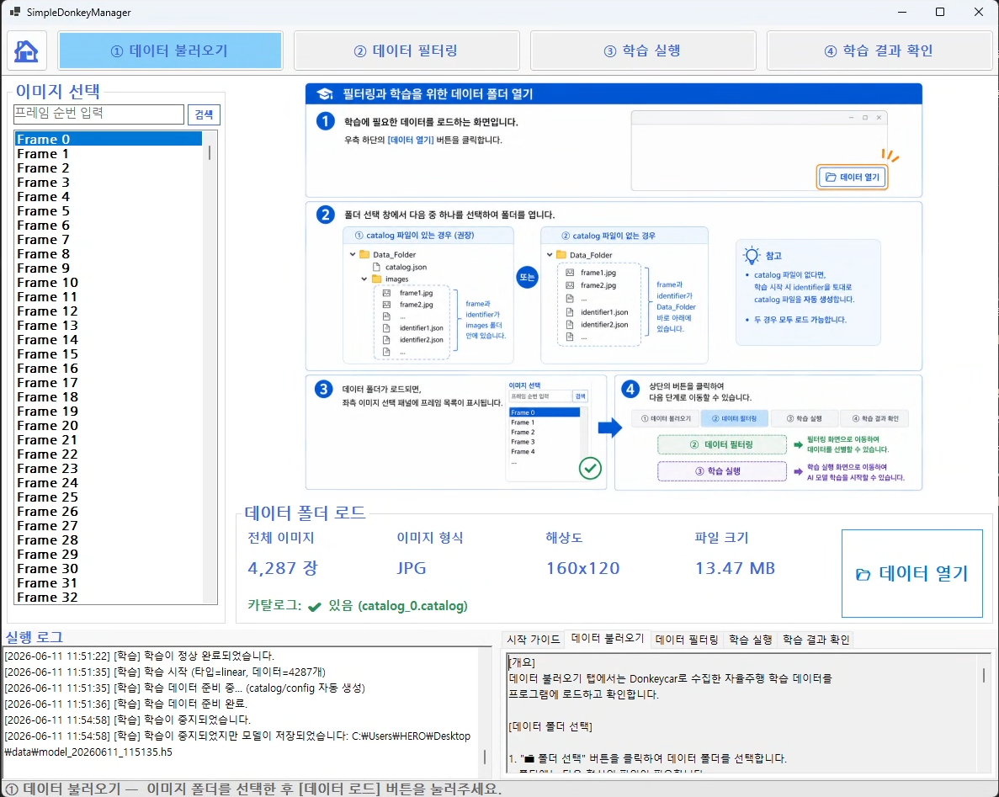

### 2. 데이터 필터링

`② 데이터 필터링` 화면에서는 학습에 쓰기 어려운 프레임을 제외합니다.

기본 필터에서는 다음 기준을 사용할 수 있습니다.

- throttle 값이 0인 프레임 제외
- 기본 반전 이미지 제외
- 조향각(angle) 범위 지정
- throttle 범위 지정
- 해상도 기준 필터링

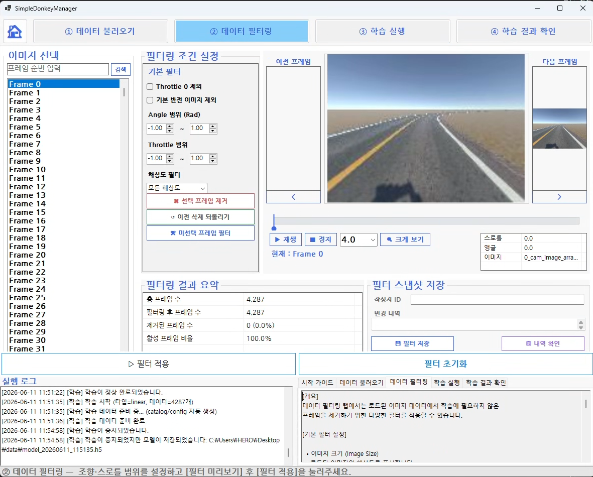

이미지 재생기와 타임라인을 이용해 특정 구간을 직접 선택한 뒤, 선택하지 않은 구간을 필터링할 수도 있습니다. 급격히 흐름이 깨지는 구간이나 필요 없는 주행 구간을 정리할 때 사용합니다.

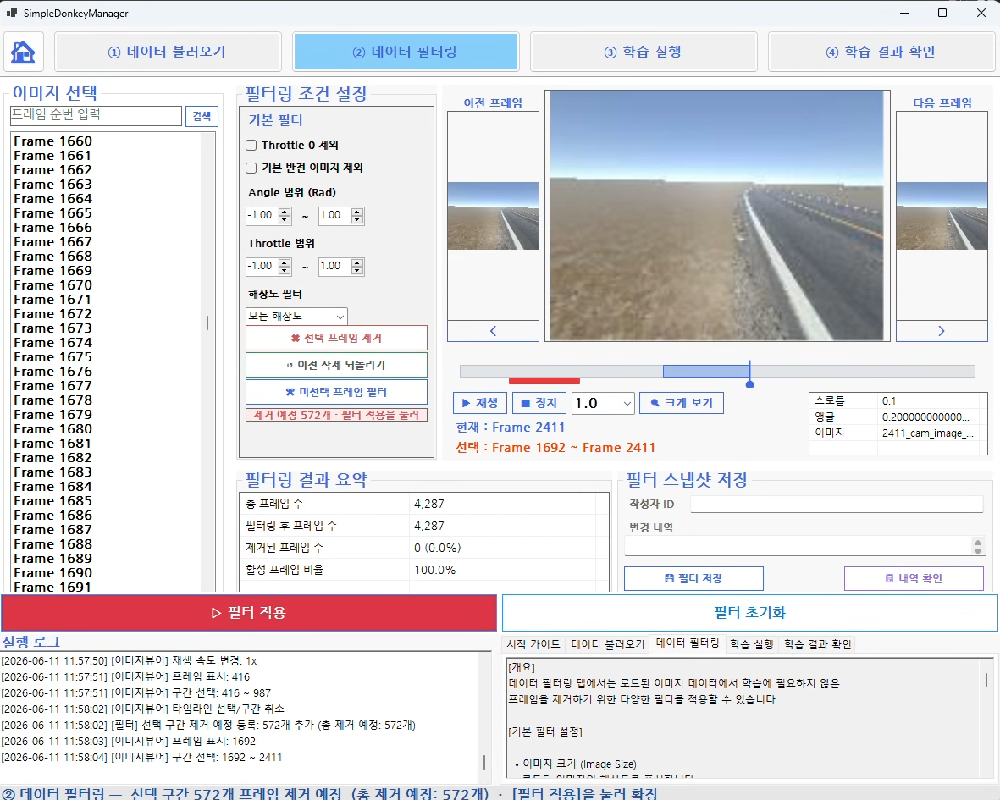

프레임을 크게 보면서 전후 프레임과 메타데이터를 확인할 수 있는 확대 보기 화면도 제공합니다.

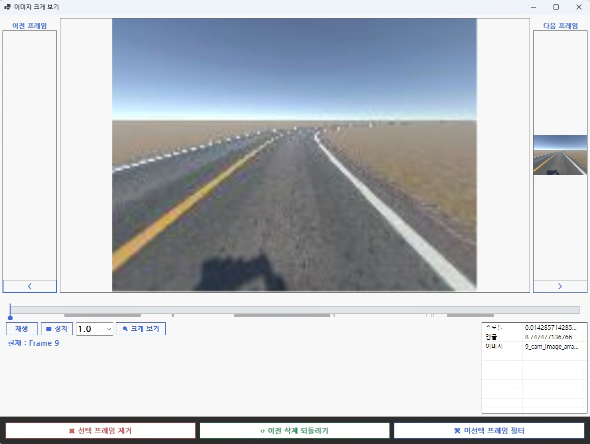

필터링 상태는 스냅샷으로 저장할 수 있습니다. 누가 어떤 기준으로 제외했는지 남기고, 필요하면 특정 시점으로 되돌릴 수 있습니다.

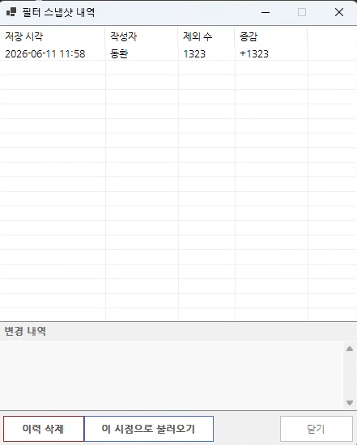

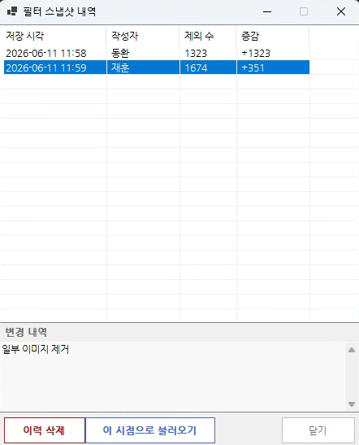

### 3. 학습 실행

`③ 학습 실행` 화면에서는 불러온 데이터 또는 필터링된 데이터를 이용해 DonkeyCar 모델을 학습합니다.

모델 저장 경로와 모델 타입을 선택한 뒤 학습을 시작하면, 진행률과 로그가 실시간으로 표시됩니다. 오른쪽 그래프에서는 epoch별 loss 변화를 바로 확인할 수 있습니다.

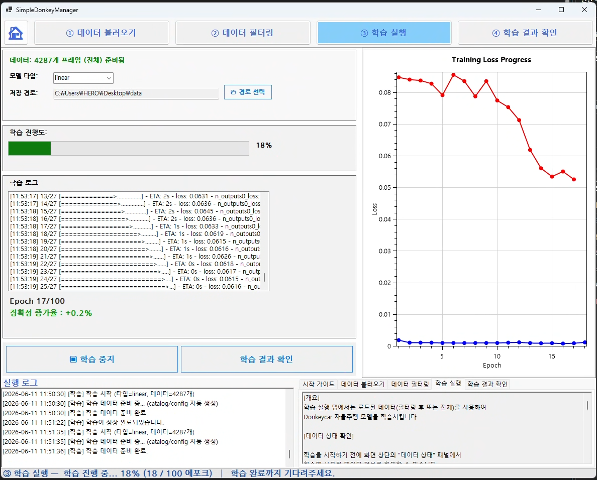

학습을 중지해도 해당 시점까지 저장 가능한 모델이 있으면 저장 경로를 로그로 확인할 수 있습니다.

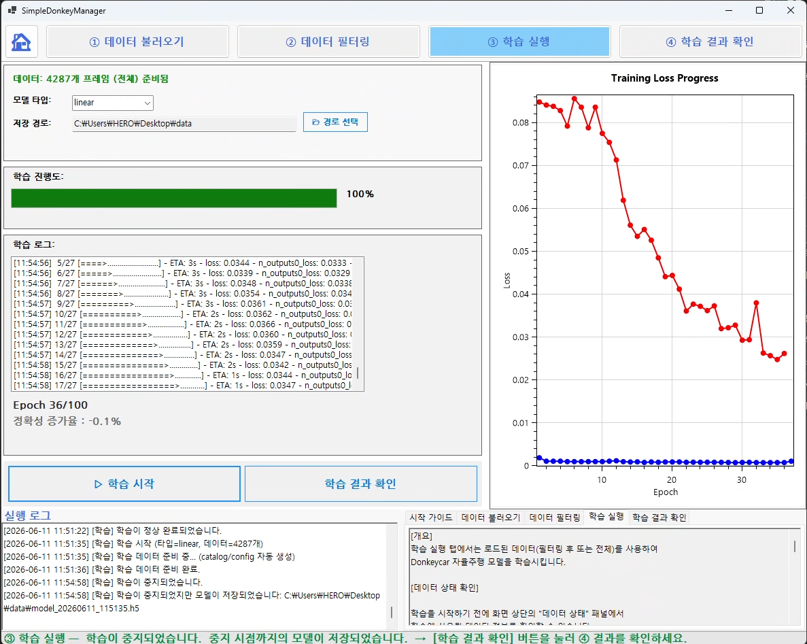

### 4. 결과 확인 및 검증

`④ 학습 결과 확인` 화면에서는 학습 요약과 loss 그래프를 확인합니다. 저장된 모델 폴더를 열어 결과 파일도 바로 확인할 수 있습니다.

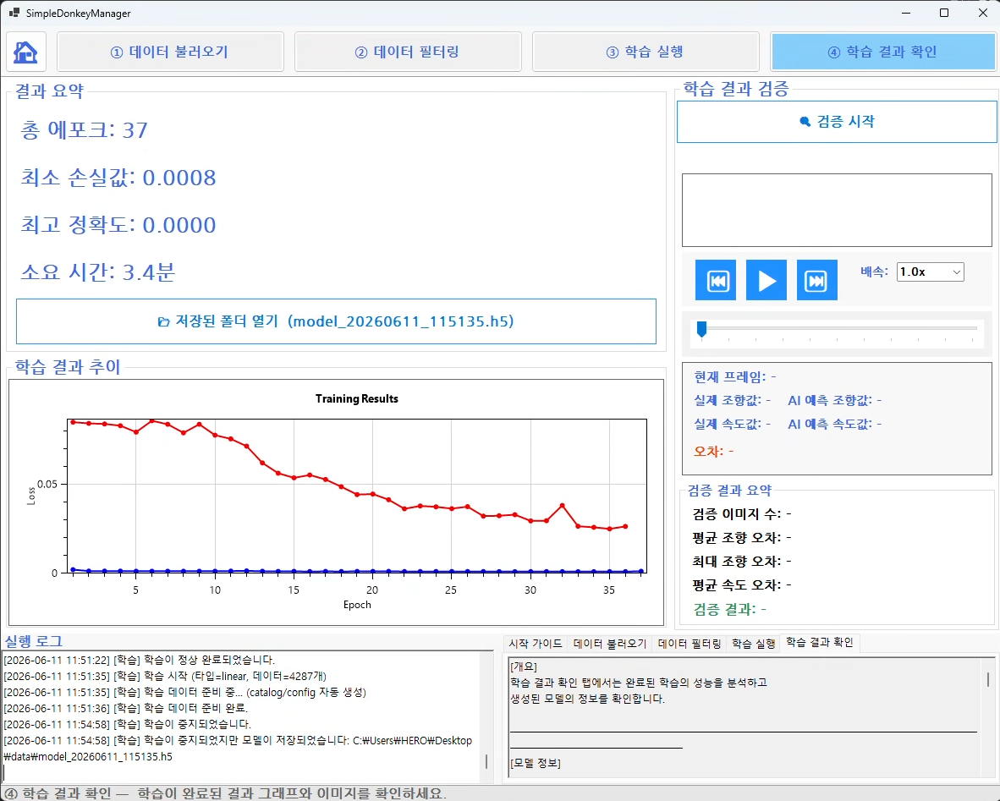

검증을 실행하면 학습된 모델로 각 프레임을 추론하고, 실제 조향값과 AI 예측 조향값을 비교합니다. 이미지 재생기 위에는 실제 진행 방향과 예측 진행 방향이 화살표로 표시됩니다.

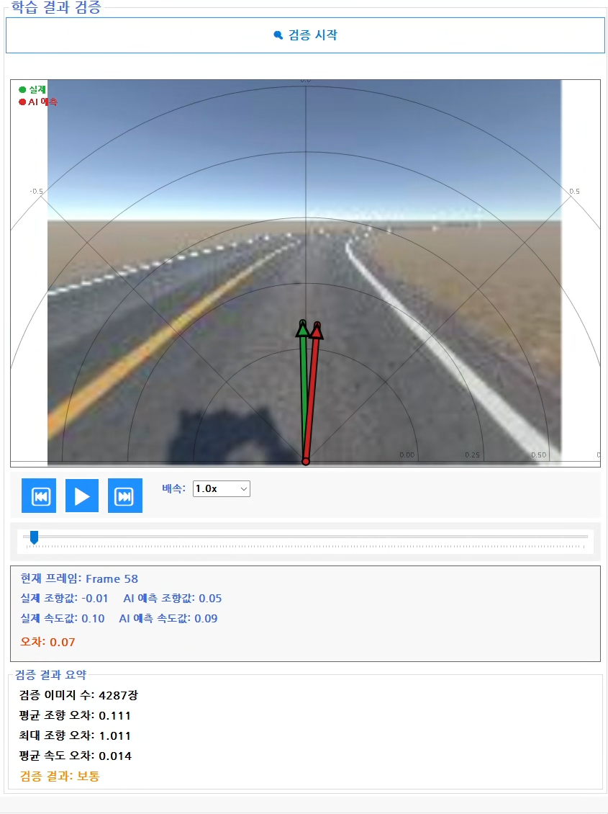

검증이 끝나면 전체 프레임에 대한 실제 조향값과 AI 예측 조향값의 추이를 그래프로 확인할 수 있습니다.

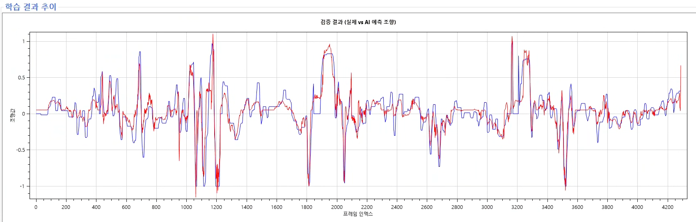

## 지원 데이터 형식

DonkeyCar tub 데이터 형식을 기준으로 합니다.

```text
data_folder/
├─ manifest.json
├─ catalog_0.catalog
└─ images/
   ├─ 0_cam_image_array_.jpg
   ├─ 1_cam_image_array_.jpg
   └─ ...
```

구형 데이터처럼 `record_*.json`, `meta.json`, 이미지 파일이 함께 있는 구조도 학습 전에 `python/prepare_tub.py`를 통해 tub v2 형식으로 준비하도록 처리했습니다.

## 주요 구성

```text
SimpleDonkeyManager/
├─ MainWindow.cs                  # 전체 화면 전환과 상태 관리
├─ controls/
│  ├─ InitialScreen.cs            # 시작 화면, 자동 환경 설정 실행
│  ├─ DataLoadControl.cs          # 데이터 폴더 로드
│  ├─ DataFilterControl.cs        # 프레임 필터링, 스냅샷 관리
│  ├─ TrainingControl.cs          # 모델 학습 실행
│  └─ ResultControl.cs            # 학습 결과 및 검증
├─ controlutils/
│  ├─ ImageList.cs                # 프레임 목록
│  ├─ ImageViewer.cs              # 이미지 확인/재생
│  ├─ ValidationViewer.cs         # 검증 결과 재생기
│  └─ FrameTimeline.cs            # 구간 선택 타임라인
├─ python/
│  ├─ prepare_tub.py              # 학습 전 데이터 준비
│  ├─ train.py                    # DonkeyCar 학습 실행
│  └─ validate_model.py           # 모델 검증
└─ resources/
   ├─ setup-environment.ps1       # 자동 환경 설정 스크립트
   └─ readme_screenshots/         # README 이미지
```

## 팀원 및 역할

| 이름 | 역할 |
| --- | --- |
| 김동환 | 팀장, 코딩 총괄, 공용 모듈 관리, 필터링 화면 및 기능 구성 |
| 이재훈 | 초기 화면 및 데이터 로드 화면 및 기능 구성, 데이터 관리 |
| 문규승 | 학습 및 학습 결과 확인/검증 기능 구성, UI 최적화 |
| 채민정 | 학습 및 학습 결과 확인/검증 화면 구성, 이미지 재생기 구성 |

## 참고

- DonkeyCar 공식 문서: <https://docs.donkeycar.com/>
- Python venv 문서: <https://docs.python.org/3/library/venv.html>
- .NET 문서: <https://learn.microsoft.com/dotnet/>

## 상태

현재 버전은 Windows 환경에서 DonkeyCar 학습 데이터 관리와 학습/검증 흐름을 확인하는 데 초점을 맞춘 조별 프로젝트 결과물입니다.
